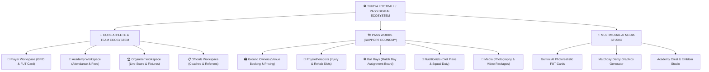

# ⚽ Turiya Football / PASS Ecosystem & PASS Works — Master Official Website Documentation

> **Document Title**: Turiya Football & PASS Digital Ecosystem — Complete Master Specification  
> **Document Version**: 3.0.0  
> **Target Audience**: Website Development Team, UI/UX Designers, Product Managers, Marketing & PR Teams, Association Partners, Scouting Networks  
> **Project Scope**: Official Website Content, Ecosystem Blueprint, PASS Works Infrastructure, Grassroots Impact Analysis, Database Schemas & API Integration  

---

## 📌 Executive Summary & Core Ecosystem Vision

**Turiya Football (PASS - Player Academic Sports System)** is India's premier digital grassroots football ecosystem. Built to transform Indian football from the ground up, PASS bridges the historic gap between grassroots players, training academies, certified coaches, tournament organizers, state/district associations, and football support professionals.

### The Grassroots Football Crisis in India & How PASS Solves It:
1. **Unregistered Talent & Lost Player Records**: Millions of talented young players across India play without digital records or verifiable match histories. **PASS solves this** with the **GFID (Grassroots Football ID)** QR passport and AIFF-aligned digital profiles.
2. **Operational Chaos in Academies**: Grassroots academies struggle with paper registers, unpaid fees, and manual admissions. **PASS solves this** with automated student rosters, QR code attendance tracking, digital fee ledgers, and an admissions desk.
3. **Unstandardized Tournaments**: Local leagues suffer from disputable match results, manual points tables, and lack of real-time visibility. **PASS solves this** with a live scorekeeper, instant standings updates, automated fixture generators, and certified match report logs.
4. **Missing Support Professional Network**: Football grounds, sports physiotherapists, nutritionists, match day ball boys, and sports photographers operate in isolation without a centralized discovery platform. **PASS solves this** through **PASS Works**, an integrated support professional economy layer.
5. **Lack of Scouting Infrastructure**: Talent scouts cannot discover raw talent from non-metro regions. **PASS solves this** by centralizing verified player stats, FUT skill cards, 5-Step showcase stories, and highlight videos on a nationwide platform.



---

## 🌟 Core Value Propositions (Official Website Marketing Copy)

> [!TIP]
> **Recommended Main Hero Headline for Website**:  
> *"Empowering India's Next Generation of Football Talent with AI, Digital Passports & A Unified Sports Ecosystem."*

### Key Selling Points by Ecosystem Role:

| Ecosystem Role | Primary Value Proposition | Core Features Highlighted on Website |
| :--- | :--- | :--- |
| **Players & Athletes** | Build your verified digital football resume and get scouted nationwide. | GFID QR Passport, FUT Skill Attributes (`PAC`, `SHO`, `PAS`, `DRI`, `DEF`, `PHY`), 5-Step Story Showcase, Career Stats. |
| **Academies & Clubs** | Automate academy operations, student attendance, fees, and admissions in one dashboard. | Multi-age Roster, QR Attendance Tracker, Fee Ledger, Squad Assignment, Custom Crest Studio. |
| **Tournament Organizers** | Schedule fixtures, run live match timers, and generate automated tournament standings. | Live Scorekeeper Marquee, Instant Points Tables (P, W, D, L, GF, GA, GD, PTS), Venue Booking, Referee Dispatch. |
| **Coaches & Referees** | Showcase certified credentials, offer rate cards, and publish training courses. | Verified Hiring Rate Cards, Video Course Studio, Drill Task Assignment, Official Match Logs. |
| **Ground Owners** | Monetize football fields and futsal turfs with automated slot bookings. | Hourly/Daily INR Rates, Slot Calendar, Booking Approval Desk, Integrated Payments. |
| **Physiotherapists & Medics** | Offer clinical sports injury rehabilitation and matchday medic services. | Certified Profile, Session Slot Calendar, Individual/Squad Duty Packages, Patient Notes. |
| **Ball Boys & Match Staff** | Earn income and gain match-day experience at official local tournaments. | PWD ID, Match Invitation Board, Assignment Calendar, Organizer Ratings. |
| **Nutritionists & Fitness** | Provide customized athlete meal plans and fitness monitoring. | Diet Plan Builder, Body Composition Tracker, Monthly Academy Squad Contracts. |
| **Media & Photographers** | Capture and sell high-resolution matchday media to players & organizers. | Portfolio Gallery, Package Pricing, Event Bookings, Direct Asset Delivery. |
| **Scouts & Associations** | Discover verified regional talent and enforce regional football governance. | Nationwide Player Search Filters, Scout Bookmarks, AIFF Alignment, Regional Registries. |

---

## 🏗️ Deep Dive: PASS Works (Football Support Ecosystem)

**PASS Works** is the dedicated service economy layer within the PASS platform. It allows specialized sports professionals and venue owners to create verified service profiles, set their pricing in INR, manage booking calendars, and deliver services directly to players, academies, and tournament organizers.

### 🆔 PASS Works Identification System (PWD ID):
Every registered support professional receives a unique **PWD (PASS Works Delegate)** ID card:

| Support Role | ID Card Format | Target Use Case / Responsibilities |
| :--- | :--- | :--- |
| **Ground Owner / Venue Manager** | `PWD-NE-GW-XXXX` | Turf/Stadium listing, slot pricing, match day host operations. |
| **Physiotherapist / Sports Medic** | `PWD-NE-PT-XXXX` | On-field matchday medic duty, pre-season fitness testing, injury rehab. |
| **Ball Boy / Match Staff** | `PWD-NE-BB-XXXX` | Ball management at official matches, gear handling, pitch assistant. |
| **Nutritionist / Fitness Coach** | `PWD-NE-NU-XXXX` | Personalized player nutrition, matchday meal strategy, squad diet plans. |
| **Media / Photographer** | `PWD-NE-MD-XXXX` | Action photography, match highlight videography, promo graphics. |

---

### 🏛️ Detailed PASS Works Workspaces:

#### 1. 🏟️ Ground Owner & Venue Manager Workspace
* **Ground Registry & Listing**: Register multiple football pitches, futsal turfs, or multi-purpose stadiums with location coordinates, photos, surface type (natural grass, artificial turf, concrete), and seating capacity.
* **Flexible Pricing Matrix**: Set customizable pricing tiers in INR (hourly rates, half-day rates, full-day tournament packages).
* **Booking Approval Engine**: Receive instant booking requests from Organizers, Academies, or Players with options to accept, reject, or suggest alternate slots.
* **Match Day Facility Calendar**: Real-time interactive calendar displaying booked fixtures, open slots, and maintenance windows.
* **Revenue & Payout Dashboard**: Comprehensive ledger tracking earnings, pending slot payments, and payout history.

#### 2. 💉 Physiotherapist & Sports Medic Workspace
* **Certified Professional Profile**: Display medical degrees, sports physio certifications (BPT/MPT), specialization tags (ACL rehab, taping, massage, recovery), and years of field experience.
* **Service Rate Card**: Offer fixed-price individual consultation slots or multi-day academy squad retainer packages.
* **Matchday Assignment Duty**: Accept invitations from tournament organizers to serve as official on-field medical personnel for fixture days.
* **Digital Health & Rehab Records**: Securely upload injury assessment reports, recovery timelines, and exercise guidelines for player clients.

#### 3. ⚽ Ball Boy & Match Day Staff Workspace
* **Assignment Invitation Board**: Receive match invitations from verified tournament organizers based on geographic proximity.
* **Duty Status Toggle**: Switch status between `Available for Duty` and `Busy`.
* **Match Experience History**: Maintain a verified log of matches worked, grounds served, and organizer performance ratings (1 to 5 stars).
* **Earnings Log**: Track per-match stipends and completed assignments.

#### 4. 🥗 Nutritionist & Sports Fitness Workspace
* **Custom Diet Plan Builder**: Create interactive macro/micro-nutrient meal plans specifically designed for adolescent footballers, match prep, or recovery.
* **Squad Nutrition Retainers**: Contract directly with Academy Admins to manage dietary plans for entire age-group squads (U-13, U-15, U-17).
* **Client Body Metric Tracker**: Monitor player weight, body fat %, hydration levels, and energy recovery over time.

#### 5. 📸 Media Professional & Photographer Workspace
* **Showcase Portfolio Gallery**: Display high-res action photography and video highlights grouped by match category.
* **Event Booking Packages**: Sell photography/videography packages for single matches, team media days, or multi-day tournaments.
* **In-App Asset Delivery Desk**: Upload finished, edited match photos and highlight reels directly to paying players, teams, or organizers within the app.

---

## 👥 Core PASS Ecosystem Workspaces Breakdown

### 1. 👤 Player Workspace (Athlete Digital Passport)
* **GFID Passport & QR Code**: Universal Grassroots Football ID (`IND-NE-1001`) with instant QR check-in capabilities.
* **FUT Skill Attributes Card**: Comprehensive rating covering 6 core parameters (`Pace`, `Shooting`, `Passing`, `Dribbling`, `Defending`, `Physicality`) alongside an overall score (`78 CM`).
* **5-Step Showcase Story**: Dynamic portfolio highlighting position, career journey, match stats, training video clips, and bio metrics.
* **All-Time Career Stats**: Live logging of total appearances, goals, assists, MOTM awards, yellow/red cards, and 5-match form streak (`W`, `D`, `L`).
* **Daily XP Drills**: Gamified daily training tasks to build skills and gain platform experience points.

### 2. 🏫 Academy & Club Workspace
* **Squad Roster Console**: Manage player rosters grouped by age categories (U-11, U-13, U-15, U-17, Senior).
* **QR Attendance System**: Scan player GFID QR codes or toggle attendance manually with instant timestamping.
* **Tuition Fee Ledger**: Digital payment ledger tracking paid fees, pending dues, and automated payment receipts.
* **Admissions Desk**: Review incoming student applications, accept/reject candidates, and assign approved players to squads.
* **Academy Crest Studio**: Custom emblem designer to generate official academy crests.

### 3. 🏆 Tournament Organizers & Associations
* **Fixture Control Center**: Schedule fixtures, set venues, pick kick-off times, and assign home/away teams.
* **Live Scorekeeper & Event Marquee**: Real-time score updater and event marquee logger for goals, cards, and substitutions with live match clocks.
* **Automated Standings Generator**: Real-time calculation of Played (P), Won (W), Drawn (D), Lost (L), Goals For (GF), Goals Against (GA), Goal Difference (GD), and Points (PTS).
* **Certified Official Dispatch**: Assign verified coaches and referees to matches with official match report log generation.

### 4. 📋 Match Officials (Coaches & Referees)
* **Public Hiring Rate Cards**: Showcase certified license levels (AIFF D/C/B/A, FIFA/AFC), set hourly/daily rates, and receive booking requests.
* **Coach Video Course Studio**: Upload tactical training modules and video drills for academy players.
* **Official Referee Match Log**: Digital submission of cautions, send-offs, pitch conditions, and match durations directly to tournament organizers.

### 5. ✨ AI Media Studio (Multimodal Generative AI)
* **Google Gemini Multimodal AI Engine**: Harnesses Google Gemini (`gemini-2.5-flash-image` and `gemini-3.1-flash-image`) to generate photorealistic player portraits preserving exact facial features from gallery photos.
* **FUT Card Generator**: Transforms player photos into EA FC / FIFA style card graphics in Sunset Orange aesthetic.
* **Derby Matchday Promo Banners**: Generates high-impact promotional posters for upcoming tournament matches.
* **Team Crest Designer**: Creates professional football emblems for newly formed grassroots teams and academies.

---

## 🌍 How PASS Transforms the Indian Grassroots Football Ecosystem

```
+-----------------------------------------------------------------------------------+
|                        PASS ECOSYSTEM TRANSFORMATIONAL IMPACT                      |
+-----------------------------------------------------------------------------------+
| BEFORE PASS (Traditional Bottlenecks)      | AFTER PASS (Digital Ecosystem)        |
+--------------------------------------------+--------------------------------------+
| ❌ Paper registers & lost player histories  | ✅ Verified lifetime GFID QR passport |
| ❌ Isolated players with no scout access    | ✅ Centralized nationwide scout desk  |
| ❌ Cash fees & manual academy registers    | ✅ Digital fee ledger & QR attendance|
| ❌ Disputable points tables & delayed stats | ✅ Real-time live scores & standings  |
| ❌ Unemployed support staff & unlisted turfs| ✅ PASS Works booking & monetization |
| ❌ Expensive graphic design costs           | ✅ Instant Multimodal AI graphics     |
+-----------------------------------------------------------------------------------+
```

### Key Pillars of Transformation:
1. **Talent Democratization**: Young players from remote regions (e.g., North-East India, Tier 2/3 cities) receive equal digital visibility alongside metro players.
2. **Operational Professionalism**: Grassroots academies transform into organized sports businesses with streamlined fee management and verified squad rosters.
3. **Tournament Governance**: District and State Associations gain total transparency into match results, referee reports, and player eligibility.
4. **Sustainable Sports Economy**: Support professionals (physios, nutritionists, ball boys, photographers, turf owners) establish sustainable livelihoods through direct bookings.

---

## 🛠️ Complete Technical Architecture & Database Schema

### Tech Stack Overview:
* **Mobile App**: React Native (Expo SDK 54, Expo Router v4, TypeScript, Lucide Icons).
* **Backend API & Web Admin**: Laravel 11 framework, Inertia.js React Admin Panel, MySQL Database.
* **AI & Media Engine**: Google Gemini Multimodal AI (`gemini-2.5-flash-image` & `gemini-3.1-flash-image`), FLUX Engine Fallback, Public Disk Storage (`storage/ai_generated`).
* **Live Communications**: HTTP WebSocket Polling for match scores, event marquees, and notifications.

### Key Database Tables Overview:

```
[ users ] (id, name, email, phone, role, password)
    │
    ├──> [ player_profiles ] (gfid, overall_rating, pac, sho, pas, dri, def, phy, academy_id)
    ├──> [ academies ] (code, logo_url, address, owner_id)
    │     ├──> [ academy_squads ] (name, age_category)
    │     └──> [ academy_students ] (student_id, squad_id, fee_status)
    ├──> [ leagues ] (name, organizer_id, season, status)
    │     └──> [ fixtures ] (home_team_id, away_team_id, venue_id, match_date, status)
    │           └──> [ match_events ] (fixture_id, player_id, event_type, minute)
    └──> [ pass_works_profiles ] (pwid, works_role, verification_status, experience_years)
          ├──> [ grounds ] (owner_id, name, hourly_price_inr, surface, photos)
          ├──> [ ground_bookings ] (ground_id, booked_by_id, booking_date, status, payment_id)
          ├──> [ works_services ] (provider_id, works_role, service_name, price_inr)
          ├──> [ works_bookings ] (service_id, provider_id, client_id, status, rating)
          ├──> [ works_assignments ] (assigned_user_id, fixture_id, venue, payment_inr)
          └──> [ works_portfolio_items ] (user_id, media_url, event_type)
```

---

## 🔌 API Route Catalog for Website Developers

### Authentication & Profiles:
```http
POST /api/v1/auth/login                  -> User login (returns Bearer Token & User details)
POST /api/v1/auth/register-works         -> Register PASS Works support profile
GET  /api/v1/user/profile                -> Get authenticated user profile & active role
```

### Player & Scout Registry:
```http
GET  /api/v1/players/search              -> Search players by GFID, position, state, overall rating
GET  /api/v1/players/{gfid}              -> Get public player passport & 5-Step showcase
GET  /api/v1/players/{gfid}/stats        -> Get career match statistics & form streak
```

### PASS Works Support Ecosystem:
```http
GET  /api/v1/grounds/search              -> Search grounds by location, turf type, pricing
GET  /api/v1/grounds/{id}                -> Public ground detail page & availability slots
POST /api/v1/grounds/{id}/book           -> Create ground booking request
GET  /api/v1/works/services/search       -> Search physios, nutritionists, photographers
POST /api/v1/works/bookings              -> Book service appointment / squad package
GET  /api/v1/works/assignments/open      -> Open match-day ball boy / staff assignments
```

### Tournaments & Live Scores:
```http
GET  /api/v1/leagues                     -> List active tournaments & leagues
GET  /api/v1/leagues/{id}/standings      -> Real-time league points table
GET  /api/v1/fixtures/live               -> Get live ongoing match scoreboards & timers
GET  /api/v1/fixtures/{id}/marquee       -> Live match event marquee stream
```

---

## 💳 Workspace & Subscription Model

PASS uses strict **Role-Scoped Subscriptions** to ensure workspace security and targeted monetization:

```
                       +----------------------------------+
                       |      USER ACCOUNT (User #6)      |
                       +----------------------------------+
                                         |
                +------------------------+------------------------+
                |                                                 |
                v                                                 v
   [ Player Subscription ]                           [ Organizer Subscription ]
   - Target Role: player                             - Target Role: organizer
   - Plan: Player Pro Plan                           - Plan: Organizer Pro Plan
   - AI Quota: 10 images/month                       - AI Quota: 10 images/month
   - Scope: Player Workspace ONLY                    - Scope: Organizer Workspace ONLY
```

* **Role Isolation**: Subscriptions do not cross over. Player plans grant access strictly to Player features.
* **AI Quota Tracking**: Image generation limits are tracked independently per `workspace_role`.

---

## 🌐 Official Website Sitemap & Page Breakdown

Web developers should build the official portal ([turiyafootball.com](http://turiyafootball.com)) with the following primary page layout:

### 1. 🏠 Home Page (`index.html`)
* **Hero Banner**: Video carousel of Indian youth players, Sunset Orange (`#FF6B00`) callout buttons (`"Download App"` & `"Register Academy"`).
* **Live Stats Counter**:
  * ⚽ **50,000+** Registered Players
  * 🏫 **500+** Grassroots Academies
  * 🏆 **1,200+** Matches Tracked Live
  * 🏗️ **300+** PASS Works Support Partners
* **Interactive Ecosystem Tab Switcher**: Switch between Player, Academy, Organizer, Official, and PASS Works views.

### 2. 👤 For Players (`/players`)
* Complete guide to obtaining a **GFID Passport**, building **FUT cards**, and getting scouted.

### 3. 🏫 For Academies (`/academies`)
* Feature breakdown: Roster management, QR attendance, fee tracking, admissions desk. Lead capture form for academy registration.

### 4. 🏆 For Tournament Organizers (`/organizers`)
* Live scorekeeper showcase, automated points table preview, referee dispatch tools. Association partnership contact form.

### 5. 🏗️ PASS Works Portal (`/pass-works`)
* Specialized landing page for Ground Owners, Physios, Nutritionists, Ball Boys, and Photographers with onboarding registration forms.

### 6. ✨ AI Studio Gallery (`/ai-studio`)
* Showcase of generated AI FUT portraits, derby posters, and crests.

### 7. 💰 Subscription Pricing (`/pricing`)
* Clear pricing tables for Player Pro, Academy Pro, Organizer Pro, Coach Pro, Referee Pro, and PASS Works Provider plans.

---

## 🎨 Brand Design System Tokens

* **Primary Brand Color**: Sunset Orange (`#FF6B00`, `RGB(255, 107, 0)`).
* **Secondary Colors**: Slate Dark `#0F172A`, Pure Dark `#121827`, Gold `#FFD700`, Emerald Green `#10B981`.
* **Headings Font**: `Outfit` (Bold, Display Font, Uppercase).
* **Body Font**: `Space Grotesk` or `Inter`.
* **Card Standard**: Pure White `#FFFFFF` (Light Mode), Matte Dark `#121827` (Dark Mode) with 1px border `rgba(0,0,0,0.08)`.
* **Zero Dummy Data Standard**: Web developers must connect dynamic sections directly to backend API endpoints.

---

## 🚀 Web Developer Implementation Checklist

- [x] Apply **Sunset Orange (`#FF6B00`)** brand color across all web buttons, badges, and active state highlights.
- [x] Embed **Google Play Store** and **Apple App Store** download links in hero and footer.
- [x] Build interactive **Ecosystem Role Tab Switcher** (Player, Academy, Organizer, Officials, PASS Works).
- [x] Integrate lead capture forms for **Academy Onboarding** & **Association Partnerships**.
- [x] Ensure 100% mobile responsiveness, dark mode support, and fast load performance.

---

*This document is the official, complete master specification for the Turiya Football / PASS Ecosystem and PASS Works platform.*
